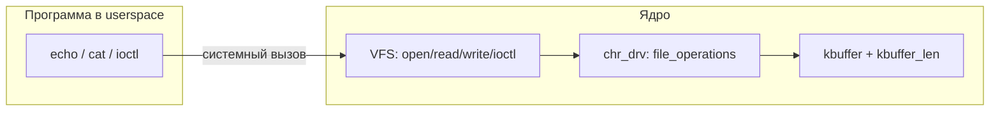

# chr_drv — символьный драйвер ядра Linux

Учебный модуль ядра: символьное устройство с операциями `read`, `write`, `ioctl`, регистрацией в `/dev`, `/proc` и `/sys`. Данные хранятся во внутреннем буфере размером 256 байт.

**Версия:** 1.0  
**Автор:** Smolovoy Sergey  
**Лицензия:** GPL

## Структура проекта

```
Final_linux_kernel/
├── Makefile              # сборка, load/unload, install
├── Kbuild                # список объектов модуля
├── src/
│   ├── chr_drv.c         # module_init / module_exit
│   ├── chr_drv_main.c    # file_operations, регистрация, /proc, sysfs устройства
│   ├── chr_drv_params.c  # параметр модуля debug
│   ├── chr_drv.h         # chr_drv_init / chr_drv_exit
│   └── chr_drv_int.h     # константы, ioctl, размер буфера
└── build/
    └── chr_drv.ko        # собранный модуль (после make kbuild)
```

## Требования

- Заголовки ядра для текущей версии: `linux-headers-$(uname -r)`
- `make`, компилятор GCC (как у сборки ядра)
- Для `make load`, `install` — права root (`sudo`)

## Сборка и загрузка

```bash
make kbuild          # собрать build/chr_drv.ko
make load            # собрать и загрузить (insmod)
make unload          # выгрузить (rmmod)
make clean           # очистить артефакты сборки
make help            # список целей
```

Загрузка с включённой отладкой в журнале ядра:

```bash
sudo insmod build/chr_drv.ko debug=1
# или после make load:
echo 1 | sudo tee /sys/module/chr_drv/parameters/debug
```

Проверка:

```bash
lsmod | grep chr_drv
modinfo build/chr_drv.ko
dmesg | tail
ls -l /dev/chr_drv /proc/chr_drv
ls -l /sys/class/chrdrvclass/chr_drv/
```

## Установка в систему

Копирует модуль в `/lib/modules/$(uname -r)/extra/` и обновляет зависимости (depmod +a):

```bash
sudo make install
```
Проверка:
```bash
sudo modprobe chr_drv
```

## Удаление модуля из системы
```bash
sudo make uninstall            # удаление из extra + depmod -a
```

## Интерфейсы после загрузки

| Путь | Назначение |
|------|------------|
| `/dev/chr_drv` | Основное устройство: read, write, ioctl |
| `/proc/chr_drv` | Статус: версия, major/minor, размер буфера, длина данных, флаг debug, содержимое буфера |
| `/sys/class/chrdrvclass/chr_drv/length` | Текущая длина данных в буфере (read-only) |
| `/sys/class/chrdrvclass/chr_drv/buffer` | Содержимое буфера как строка (read-only) |
| `/sys/module/chr_drv/parameters/debug` | Параметр модуля: подробный printk (0/1) |

Класс устройства в sysfs: `chrdrvclass`, имя узла: `chr_drv`.

## Логика работы

### Общая картина

В ядре у модуля есть **один общий буфер** на все процессы:

```
kbuffer[256]     — сами байты
kbuffer_len      — сколько байт «живых» (0…256)
chr_buf_mutex    — замок: только один read/write/ioctl в буфере одновременно
```

Это **не файл на диске**. Данные живут только в RAM драйвера, пока модуль загружен.



Путь вызова: программа → `read()`/`write()` в libc → системный вызов → ядро находит `/dev/chr_drv` → вызывает функции из `chr_drv_fops` (`chr_drv_read`, `chr_drv_write`, …).

### Загрузка модуля (`insmod`)

1. `chr_drv.c`: `module_init` → `chr_drv_init()`.
2. Регистрация: номер major/minor, `cdev`, класс `chrdrvclass`, узел `/dev/chr_drv`, `/proc/chr_drv`, sysfs-атрибуты `length` и `buffer`.
3. Буфер пустой: `kbuffer_len = 0`.

После этого пользователь может открывать `/dev/chr_drv` как обычный файл.

### `open` и `close`

| Вызов | Что делает драйвер |
|--------|---------------------|
| `open("/dev/chr_drv")` | `chr_drv_open`: почти ничего, возвращает 0. У **каждого** открытия свой счётчик позиции `ppos` (в структуре `file`), изначально **0**. |
| `close()` | `chr_drv_release`: логирование при `debug=1`. Буфер **не** трогается. |

Важно: `open` **не очищает** буфер. Очистка только через новую **запись** (заменяет содержимое) или `ioctl CLEAR`.

### Запись (`write`) — как данные попадают в устройство

Пример: `echo -n "Hello" > /dev/chr_drv`

1. Ядро вызывает `chr_drv_write`.
2. Драйвер **всегда** пишет с `kbuffer[0]` (позиция `ppos` в буфере не используется).
3. Копируется `min(размер_запроса, 256)` байт; остальное **отбрасывается**.
4. `kbuffer_len` = сколько байт реально записали (новая длина содержимого).

После `"Hello"`: `kbuffer_len = 5`. После следующей записи `"Hi"`: в буфере только `"Hi"`, `kbuffer_len = 2` (старый хвост не остаётся).

Запись 300 байт → в буфере 256, в `write` возвращается 256.

### Чтение (`read`) — как данные отдаются программе

Пример: `cat /dev/chr_drv`

1. `open` → у процесса `ppos = 0`.
2. `chr_drv_read` копирует из `kbuffer + ppos` в программу, сдвигает `ppos`.
3. `ppos >= kbuffer_len` → возврат **0** (EOF для этого дескриптора).
4. **`kbuffer` не меняется** — повторный `cat` (новый `open`, снова `ppos = 0`) снова выдаёт те же данные.

В одном сеансе (`dd`, несколько `read`) после EOF нужен новый `open` (или новая `write`, она сбрасывает `ppos` в 0).

### `ioctl` — управление без чтения/записи

| Команда | Действие |
|---------|----------|
| `CLEAR` | `kbuffer_len = 0`, память обнуляется |
| `GET_LEN` | вернуть текущую `kbuffer_len` |
| `GET_DEBUG` / `SET_DEBUG` | флаг подробных сообщений в `dmesg` |

### `/proc` и sysfs — только «посмотреть»

- `/proc/chr_drv` и атрибуты `length`, `buffer` в sysfs **читают** `kbuffer` / `kbuffer_len` для отладки.
- Запись в них **не меняет** буфер (в отличие от `/dev/chr_drv`).

### Типичные сценарии в shell

| Действие | Что происходит с буфером |
|----------|---------------------------|
| `echo -n "A" > /dev/chr_drv` | В буфере `"A"`, `len=1` |
| `cat /dev/chr_drv` | Читает `"A"`, буфер по-прежнему `"A"` |
| `cat /dev/chr_drv` снова | Снова `"A"` |
| `echo -n "Hi" > …` после `"Hello"` | В буфере `"Hi"`, `len=2` |
| `ioctl CLEAR` | `len=0` |

### Семантика (кратко)

- **write** — всегда заменяет содержимое с нуля, не больше 256 байт;
- **read** — только чтение, буфер не трогает;
- один общий буфер на все процессы.

### Несколько процессов и `ppos`

Буфер (`kbuffer`, `kbuffer_len`) **один на всех**, а **`ppos` — у каждого открытия свой** (у каждого `open` / файлового дескриптора). Запись сбрасывает `ppos` только у **того** fd, с которого пишут; у уже открытых `cat` позиция не меняется.

Одновременный доступ защищён `chr_buf_mutex`: `read` / `write` / `ioctl` не выполняются в буфере параллельно. За пределы массива не читаем: в `read` сначала проверка `ppos >= kbuffer_len` → **0 (EOF)**, иначе `count = min(..., kbuffer_len - ppos)`.

**Если во время чтения другой процесс сделает `write`:**

| Было у читателя | Стало после чужой записи | Что получит читатель при следующем `read` |
|-----------------|--------------------------|-------------------------------------------|
| `ppos >=` новый `kbuffer_len` | буфер короче или пуст | **EOF** (0 байт), без падения и без мусора |
| `ppos <` новый `kbuffer_len` | буфер заменён целиком | чтение **с той же позиции** уже из **нового** содержимого (начало новой строки можно «пропустить») |

Пример второго случая: один процесс дочитал 5 байт из `"Hello"` (`ppos=5`), другой записал `"Hi"` (`kbuffer_len=2`) — у первого `ppos=5 >= 2`, дальше только EOF. Если бы после `ppos=2` записали `"World"` (`len=5`), первый прочитал бы байты с индекса 2 нового буфера (`"rld"`), а не всё сообщение с начала.

Для shell и простых тестов обычно хватает коротких сессий (`echo` / `cat` закрывают fd). Если два процесса держат устройство открытым долго и пишут/читают параллельно — после чужой **write** надёжнее **закрыть и снова открыть** `/dev/chr_drv` (или не держать старый fd между чужими записями).

## Примеры: read и write

```bash
# запись в буфер драйвера
echo -n 'Hello, kernel!' | sudo tee /dev/chr_drv

# чтение (буфер не очищается)
sudo cat /dev/chr_drv

# повторный cat — те же данные
sudo cat /dev/chr_drv

# просмотр через proc и sysfs
cat /proc/chr_drv
cat /sys/class/chrdrvclass/chr_drv/length
cat /sys/class/chrdrvclass/chr_drv/buffer
```

Запись больше 256 байт: в буфер попадут первые 256, остальное отбросится; `write` вернёт 256 (ошибки `ENOSPC` нет — запись всегда с нуля).

## ioctl

Команды (magic `'c'`, см. `src/chr_drv_int.h`):

| Команда | Направление | Действие |
|---------|-------------|----------|
| `CHR_DRV_IOC_CLEAR` | — | Очистить буфер |
| `CHR_DRV_IOC_GET_LEN` | read | Вернуть `size_t` — текущую длину данных |
| `CHR_DRV_IOC_GET_DEBUG` | read | Вернуть `int`: 0/1 — флаг debug |
| `CHR_DRV_IOC_SET_DEBUG` | write | Установить debug (0 или 1) |

Минимальная программа для userspace (`test_ioctl.c`):

```c
#include <fcntl.h>
#include <stdio.h>
#include <stdlib.h>
#include <sys/ioctl.h>
#include <unistd.h>

#define CHR_DRV_IOC_MAGIC 'c'
#define CHR_DRV_IOC_CLEAR     _IO(CHR_DRV_IOC_MAGIC, 0)
#define CHR_DRV_IOC_GET_LEN   _IOR(CHR_DRV_IOC_MAGIC, 1, size_t)
#define CHR_DRV_IOC_GET_DEBUG _IOR(CHR_DRV_IOC_MAGIC, 2, int)
#define CHR_DRV_IOC_SET_DEBUG _IOW(CHR_DRV_IOC_MAGIC, 3, int)

int main(void)
{
	int fd = open("/dev/chr_drv", O_RDWR);
	size_t len;
	int dbg;

	if (fd < 0) {
		perror("open");
		return 1;
	}

	write(fd, "ioctl test", 10);

	if (ioctl(fd, CHR_DRV_IOC_GET_LEN, &len) == 0)
		printf("len = %zu\n", len);

	ioctl(fd, CHR_DRV_IOC_SET_DEBUG, &(int){1});
	ioctl(fd, CHR_DRV_IOC_GET_DEBUG, &dbg);
	printf("debug = %d\n", dbg);

	ioctl(fd, CHR_DRV_IOC_CLEAR, NULL);
	ioctl(fd, CHR_DRV_IOC_GET_LEN, &len);
	printf("len after clear = %zu\n", len);

	close(fd);
	return 0;
}
```

Сборка и запуск:

```bash
gcc -Wall -o test_ioctl test_ioctl.c
sudo ./test_ioctl
```

## Обработка ошибок

- Проверка указателей userspace (`NULL` → `-EINVAL`, ошибка копирования → `-EFAULT`)
- Неизвестная команда ioctl → `-ENOTTY`
- При сбое инициализации выполняется откат уже зарегистрированных ресурсов (region, cdev, class, device, proc)
- `chr_drv_exit` снимает регистрации в обратном порядке

## Дополнительные цели Makefile

```bash
make format    # clang-format для src/*.c (нужен clang-format-19)
sudo make check   # автотесты (checker/check.sh)
```

## Автотесты (`make check`)

Нужны права root. Скрипт `checker/check.sh`:

1. Собирает модуль (`make kbuild`)
2. Загружает `chr_drv.ko`, проверяет `modinfo`
3. Проверяет наличие `/dev`, `/proc`, sysfs-атрибутов и параметра `debug`
4. Тестирует `write`/`read`, содержимое `/proc/chr_drv` и sysfs
5. Запускает `checker/test_ioctl` (ioctl: GET_LEN, CLEAR, GET/SET_DEBUG, неверная команда)
6. Проверяет чтение из пустого буфера, перезагрузку модуля
7. Выгружает модуль при выходе

```bash
sudo make check
# или
sudo checker/check.sh
```

При успехе: `PASS: N  FAIL: 0`. Код выхода 1 при любой ошибке.

## Ручное тестирование

1. **read/write** — `echo` / `cat` на `/dev/chr_drv`, сверка с `/proc/chr_drv` и sysfs-атрибутами.
2. **ioctl** — `checker/test_ioctl` или пример `test_ioctl.c` ниже.
3. **proc/sys** — после записи данные видны в `/proc/chr_drv`, `length` и `buffer` в sysfs.
4. **параметр debug** — `insmod ... debug=1` или ioctl `SET_DEBUG`, в `dmesg` появляются дополнительные `pr_info` при open/write/ioctl.

Выгрузка:

```bash
sudo make unload
# или
sudo rmmod chr_drv
```
